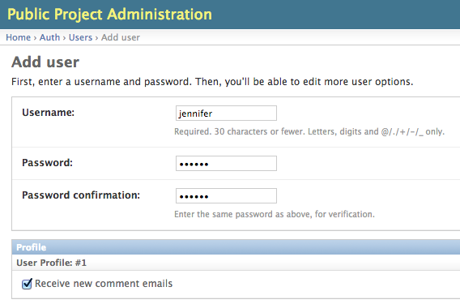
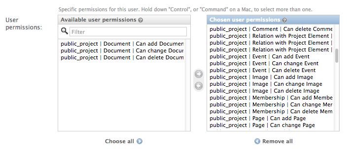

.. _administration:

==============
Administration
==============

User Management
===============

Often it makes sense to work with several people with several accounts on one project. You can add new
users in the ``User`` menu in the admin:

If you leave the ``Receive new comment emails`` checkbox checked the user will get emails on new comments
and will be able to publish them. After clicking ``save`` be sure to activate ``Staff status`` on the
following ``Change User`` form so that the user is able to log into the ``admin``.

**Management of user rights** is a bit tricky. Since everything in ``DPP`` is so interconnected if you
just grant some single user permissions to a user it is easy to miss some dependent item prevent the
user from finishing a desired task because he/she has not the necessary user rights. For that reason
it may be easier choosing all user rights in the first place and then explicitly removing the ones
you don't want to grant, e.g. the right to add/edit/delete documents:

Backing up the Database
=======================

When backing up the database of a DPP installation, it works best to use the ``-n`` option for
saving content type and some ohter references as natural keys and at the same time ommit backing up the 
contenttypes app and the auth.Permission model. This makes it easier to recover an installation
after DB data loss, since Django is automatically generating the content type objects (used in DPP
for comments) which could lead to problems with IDs if not using natural keys::

    python manage.py dumpdata -n -e contenttypes -e auth.Permission > dpp_dump.json

When loading the data from a generated dump it is important to comment out the ``post_save`` signals
from the ``models.py`` file, otherwise an error will occur::

    python manage.py loaddata dpp_dump.json
