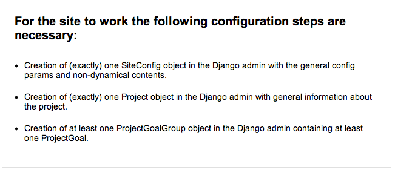

.. _developers:

==========
Developers
==========

.. _installation:

Introduction
============

DPP comes as a ``Django`` app providing all the data models necessary and the templates for the front end
layout. This app can be integrated in a ``Django`` project representing the concrete project to be targeted.

.. warning:: This software currently is in ``alpha`` status. It can be used in a productive environment,
             but await sudden changes of Django model declarations, software dependencies or config settings. 

Requirements
============

You need the following ``Python/Django`` libraries, probably best installed in an own ``virtualenv`` environment:

* Python 2.7+ (earlier versions untested)
* `Django <https://www.djangoproject.com/>`_ 1.5+
* `PDFMiner <http://www.unixuser.org/~euske/python/pdfminer/index.html>`_
* Python Image Library PIL 1.1.7+ (for Django ImageField type)
* `Tastypie <http://tastypieapi.org/>`_ 0.9+ (for API access)
* `South <http://south.aeracode.org/>`_ 0.7.6+ (to keep track with DB changes)

For PDF conversion to jpg files for having an IE compatible PDF viewer, you need to have the 
``ImageMagick`` library with the ``convert`` command installed in your shell environment:

* `ImageMagick (convert tool) <http://www.imagemagick.org/>`_

.. note:: There are some fabric tasks which can help you set up an environment for DPP located in
          an own GitHub repository which can be found here: https://github.com/holgerd77/django-public-project-fabric-tasks/

Installation
============

Installation with Pip
---------------------
``DPP`` is now on the ``Python Package Index`` and you can install the software with all dependencies
with::

    pip install django-public-project

Manual Installation
-------------------
If you want to have the latest version of ``DPP``, you can install the sources manually 
with ``PIP`` (or directly clone the GitHub repository)::

    pip install -e git+https://github.com/holgerd77/django-public-project.git@master#egg=django-public-project

Then install the requirements above. There is a ``requirements.txt`` file in the main directory
of the repository you can use::

    pip install -r requirements.txt

Project Creation
---------------- 
Create your ``Django`` project::

    django-admin.py startproject myprojectwatch

Add the Django apps installed to your ``settings.py`` file (of course you also need the admin app which
is essential for DPP)::

    INSTALLED_APPS = (
        ...
        'django.contrib.admin',
        'tastypie',
        'public_project',
        'south',
    )

Sync your database respectively use migrations for DPP::

    python manage.py syncdb (due to database dependencies, don't create a superuser yet)
    python manage.py migrate
    python manage.py createsuperuser

Configuration
=============

DPP is not really an app which you would install beside many other Django apps and integrate it in a more
complex website. It is more a content management system already coming with an url structure and a given
layout capsuled in a single app. So DPP takes control of more things than the normal Django app.

URL structure
-------------
The urlpatterns for your project are completely coming from DPP, with an exception of the admin url,
which should be adoptable for security reasons. So your minimal urls.py should look similar to this,
importing the main url patterns from ``public_project.urls``::

    from django.conf.urls import patterns, include, url

    from django.contrib import admin
    admin.autodiscover()
    
    from public_project.urls import urlpatterns
    
    urlpatterns += patterns('',
        url(r'^admin/', include(admin.site.urls)),
    )

Now you should be able to enter the admin view when you start a dev server. The site itself is not yet
ready for prime time at this moment.

.. image:: images/screenshot_admin_overview.png

Basic settings
--------------
Since I'm not sure, if there are still some static references to static or media files somewhere in the code,
you should use the following ``STATIC_URL`` and ``MEDIA_URL`` settings::

   MEDIA_URL = '/media/'
   STATIC_URL = '/static/'

For being able to get email notifications about comments and document relations, you need to configure
the Django email settings properly::

    EMAIL_FROM = 'admin@yourmailaccount.com'
    EMAIL_HOST = 'smtp.yoursmtpserver.com'
    EMAIL_HOST_USER =  'YOURUSERNAME'
    EMAIL_HOST_PASSWORD = 'YOURSECUREPASSWORD'
   

DPP uses the request template context processor in its views, so add it to the ``settings.py`` file::
   
   TEMPLATE_CONTEXT_PROCESSORS = (
        "django.contrib.auth.context_processors.auth",
        "django.core.context_processors.debug",
        "django.core.context_processors.i18n",
        "django.core.context_processors.media",
        "django.core.context_processors.static",
        "django.core.context_processors.tz",
        "django.contrib.messages.context_processors.messages",
        "django.core.context_processors.request", #this line!
   )

And finally you need to enter a correct domain name (no leading ``http://``) for your Site app in the
Django admin. This is for links in mails to work properly.

Language Selection
------------------
At the moment DPP supports the following languages:

* English (en) (experimental and not yet used in production, probably you have to correct some stuff)
* German (de)

The language is chosen depending on the ``LANGUAGE_CODE`` param in the ``settings.py`` module, e.g.::

    LANGUAGE_CODE = 'de-de'

Document upload/viewer
----------------------

The document viewer in DPP is based on the Mozilla pdf.js library (included in DPP) when using modern
browsers like Google Chrome, Firefox or Safari.

For being able to view on site pdf documents with the Microsoft Internet Explorer there exists a basic 
alternative pdf viewer. For this viewer, single pages are converted to png files and are stored on disk
and you need to have the ``ImageMagick`` library installed and make sure that the ``convert`` command 
from this library can be used from within your project path.

Since this approach can take a lot of disk space for large documents and root access to the server is
needed, you have to activate IE compatible pdf viewer usage with the following setting in your 
``settings.py`` file::

    DPP_IE_COMPATIBLE_PDF_VIEWER = True

If this setting is set to false (default) a warning message will be shown on the document page for IE
users, prompting them to use an alternative browser.

If this setting is set to true, documents are saved as the original pdf file and a corresponding 
document_x folder containing the pngs in your media folder. Please test-upload a pdf document and 
see if these files are generated. Then test the url with the pdf viewer for this document in both 
the MSIE and another browser.

.. note:: The conversion process of a pdf document takes place in the background and may take a while
          for large documents.

Initial project data
--------------------
For the site to be properly displayed, you have to enter some initial project data. When you open the
main url of your dev server, you should see a message similar to the following. Please follow the
instructions.

JSON API
--------
Since ``v.0.4`` DPP comes with a public API, which let developers access the public data of the
system, leaving out internal comments and user comments. The API supports no authentication mechanism
yet and will be accessible by everyone without limitation. To activate the API, add the following to 
your ``settings.py`` file::

    DPP_PUBLIC_API = True

For the API to work you have got to have `Tastypie <http://tastypieapi.org/>`_ 0.9.15+ installed::

    pip install django-tastypie

And add ``tastypie`` to your ``INSTALLED_APPS``.

When the API is working there will be an extra link in the footer leading to to API overview page::

    http://yourproject.org/api/

.. note:: The API is still in an experimental/early stage, many features are missing and
          usage params will probably change in the future.

Backing up the Database
=======================

When backing up the database of a DPP installation, it works best to use the ``-n`` option for
saving content type and some ohter references as natural keys and at the same time ommit backing up the 
contenttypes app and the auth.Permission model. This makes it easier to recover an installation
after DB data loss, since Django is automatically generating the content type objects (used in DPP
for comments) which could lead to problems with IDs if not using natural keys::

    python manage.py dumpdata -n -e contenttypes -e auth.Permission > dpp_dump.json

When loading the data from a generated dump it is important to comment out the ``post_save`` signals
from the ``models.py`` file, otherwise an error will occur::

    python manage.py loaddata dpp_dump.json

Running the Test Suite
======================

Tests for ``DPP`` are organized in an own django project called ``bpw_tests`` located under the
folder ``tests``. For running the test suite the following libraries are required:

* `Selenium <http://selenium-python.readthedocs.org/en/latest/>`_ 2.3+
* `django-dynamic-fixture <https://github.com/paulocheque/django-dynamic-fixture>`_ 1.6+

The following types of tests are implemented:

Test Server
-----------
A test server is necessary to run some of the tests (e.g. testing RSS feeds). The test server
can be started with::

    ./testserver.sh

Browser/Selenium Tests
----------------------
The purpose of Selenium tests is to test the front-end functionality of the site. Tests are
organized in the app ``browser`` and can be run from within the ``tests`` directory with::

    python manage.py test browser #whole test suite
    python manage.py test browser.GenericTest #one test case
    python manage.py test browser.GenericTest.test_main_page #a single test method

Testing the 404 Template
------------------------
When ``DEBUG`` is set to ``True`` in ``settings.py``, ``404 template`` can be tested via the following
url::

    http://yourdevelopmenturl/404test/

How to contribute: Translation
==============================

General How-To
--------------
The main area for contribution for this project is translation, since the scope of the software is relatively
wide. So if you have got some time, speak English as a base language and another language like Spanish, Russian, 
French,... you are very welcome to help out (you don't need to be a developer for this task)!

You find the basic english language file called ``django.po`` on the 
`DPP GitHub Page <https://github.com/holgerd77/django-public-project>`_
in the following folder::
    
    public_project/locale/en/LC_MESSAGES/
    
Open this file and copy its contents. Then write the translation of the ``msg`` id strings between the 
double quotes after the ``msstr`` attribute. For longer strings you can use a format like this::

    #: models.py:123
    msgid "Structural parts of the project being stable over time."
    msgstr ""
    "Structural parts of the project being stable over time, e.g. 'Terminals', "
    "'Gates', 'Traffic Control', 'Integration of Public Transportation', not too "
    "much (<10), often useful as well: one entry for the project as a whole."
    
Just replace the ``msgstr`` with the translation in your language. If there is already a ``msgstr`` in 
english in the ``django.po`` file, use this string as a translation basis instead of ``msgid`` and
replace the english string with your language translation.

When you are ready with your translation open an issue on GitHub and past your text there or (advanced
developer version) make a pull request.

.. note:: If you have got limited time: please choose accuracy over speed, it's more helpful if you translate
          20 strings in an appropriate manner and take some time to think about the translation than translating
          50 strings and often missing the context or have spelling errors!

Generating/compiling message files
----------------------------------

For generating the message files for a specific locale from the source identifiers, change to the ``public_project``
app directory and generate the message file for the desired locale with::

    django-admin.py makemessages -l de

Then translate the missing identifier strings and compile the message files with::

    django-admin.py compilemessages

Release Notes
=============

** Changes in version 0.6-alpha** (no date yet!)

* Replaced structuring of participants by participant type with a more flexible concept allowing the
  grouping participants to other participants (groups) by a new attribute ``belongs_to`` in admin.
  DB changes, migrations ``0002_auto__del_field_participant_type.py``, ``0003_auto.py``

**Changes in version 0.5-alpha (Renaming Release)** (2013-05-27)

This release is just for renaming the Django app. Due to the development of the software it came up,
that the focus of the software is broader than actually thought, so the name ``django-public-project`` (DPP)
is misleading and the software was renamed to ``django-public-project`` (DPP). This comes with a lot of
hassle and won't happen again in the lifecyle of this software, but I felt, that in this early stage
of the software, it is the only chance to make such a step.

If you already have a deployment of the software installed and have problems upgrading please contact
me (@HolgerD77).

On ``GitHub`` the software moved to a new repository https://github.com/holgerd77/django-public-project 
with a new commit history. The ``South`` history has been restarted as well.

Steps to manually upgrade:

1. BACKUP YOUR DATABASE! BACKUP YOUR PROJECT FOLDER!
2. Create a JSON dump of your project with the ``-n`` option for preserving natural keys, leave out
   the ``South`` tables: ``python manage.py dumpdata -n -e contenttypes -e auth.Permission -e south > bpw_dpp_dump.json``
3. Rename the suffix of ``django-public-project`` specific settings in ``settings.py`` from
   ``BPW`` to ``DPP``
4. Remove ``big_projects_watch`` from ``INSTALLED_APPS`` in your ``settings.py`` file
   and add ``public_project``.
5. Enter a new database name (for security reasons, leave old DB untouched) in your ``settings.py``.
6. Run ``python manage.py syncdb``, ``python manage.py migrate``, don't create a superuser
7. Search and replace all occurrences of ``big_projects_watch`` in your JSON DB dump with 
   ``public_project`` (e.g. in vi use ":%s/big_projects_watch/public_project/g"), keep a copy of the unmodified file!
8. Load your JSON dump in the new DB with ``python manage.py loaddata yourjsonfile.json``.
9. Test your application. Sorry for the inconvenience.

**Changes in version 0.4-alpha** (2013-05-04)

* New **activity feed on main page**, integrating different activities in the system like an admin user
  adding a new object (e.g. a new event, participant, ...) or an visitor on the website commenting
  on an object. New model ``ActivityLog`` (see Migration 0016), activities are always bound to objects
  in the system, concept is flexible and expandable so that new activities around system objects can
  be added in the future
* **RSS feeds** for various pages of the system, closely connected to the activity concept.
  Feeds for the different new system objects, new comments on certain objects, a general activity feed,
  a general comment feed and a feed for new research requests (see further down)
* **Own pages/urls for questions, expanded editorial possibilities**: every question now has an own
  url and expanded possibilities to be described, new model fields for ``Question`` model class
  (see Migration 0018)
* **Integration of questions in system comments**: questions can now be referenced by site visitors
  in there comments and questions can be commented itself as well
* **New research requests associated with questions**: site owners can now give research requests
  to the crowd, describing tasks to be done or information to be found in documents. A research 
  request is always associated with a question and can further - similar to comments - be associated
  with different system objects. Site admins can directly enter new requests on the associated
  question page.
* **Experimental version of a public API** Various objects in the system can now be accessed via
  a public JSON API if desired

**Changes in version 0.3-alpha** (2013-04-08)

* Layout overhall (category colors, bigger headlines, breadcrumb navigation, UI tweaks)
* ``WITH_PUBLIC_DOCS`` setting in ``settings.py`` replaced with ``BPW_IE_COMPATIBLE_PDF_VIEWER``
  (see: :ref:`installation`)
* New detail info boxes for events, documents, used on main page to highlight newest events, documents
* Introduced search tags as new information concept (new DB models ``SearchTag``, ``SearchTagCacheEntry``,
  use ``South`` when upgrading): provided in Django admin for Events, Participants, ProjectParts, used
  for tag cloud generation and displaying documents containing these search tags on detail pages for
  Events, Participants, ProjectParts
* Search tag clouds (click induces search) on main page, document pages
* One unified crowdsource concept, merging the former concepts ``DocumentRelations`` into a broader
  ``Comments`` concept. ATTENTION! THESE CHANGES COME ALONG WITH HEAVY DB CHANGES AND NEED MANUAL 
  WORK TO GET THINGS WORKING AGAIN!
  
  * When upgrading create a dump from your ``DocumentRelation``, ``Comment`` table entries first
  * ``DocumentRelation`` model is completely removed, entries have to be manually copied into
    ``Comment`` table 
  

**Changes in version 0.2-alpha** (2013-01-22)

* Layout based on Twitter Bootstrap
* Participants, ProjectParts, ProjectGoals, Events as basic project entities
* Modeling of questions around the project
* Document upload / PDF viewer based on pdf.js
* Crowdsourcing of comments / document relations

**Changes in version 0.1-pre-alpha** (2012-08-08)

* Initial verion

