.. _tutorial:

========
Tutorial
========

The Example Project
===================

There is an **example project "Tower of Babel"** coming with the DPP sources as a ready-configured ``Django project``
containing some test data.

This tutorial is referencing the example project in the different sections. If you want you can take it 
as a basis when starting to learn, add some additional data, edit entries and play around a bit to 
get a feeling for the software. It is also possible though to directly start
entering your own project data or build up an own first example.

For using the example project find the ``example_project`` folder in your DPP installation directory and copy
the folder to your own location.

Go to your folder copy and run the following scripts to init the project::

	./init_example_project.sh
	./create_example_data.sh

.. note:: If you are running Windows and you don't have configured a way to run shell scripts from the 
          command line you have to look at both script files and run the commands manually (if you 
          rewrite these scripts as Windows batch files you are very welcome to make a pull request on
          GitHub!).

You can then start the server with ``./runserver.sh`` and should be able to reach the ``admin interface``
and front-end website via the URLs provided.

.. image:: images/screenshots/v06/example_project_dashboard.png

Website Configuration and Categories
====================================

Before you start giving some structure to your project by providing topics and entering information
about the different stakeholders and important events, you probably want to start with some general 
set-up of your site.

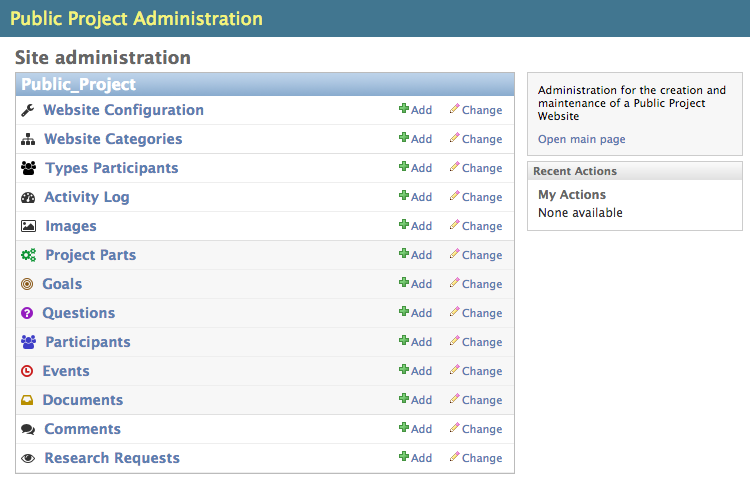

Website Configuration
---------------------
In the ``Website Configuration`` menu in your ``project admin`` you can enter a ``title`` for your project,
a short ``intro text`` for the main page and some other generic texts like contact information for the 
"Contact" page or a short footer text.

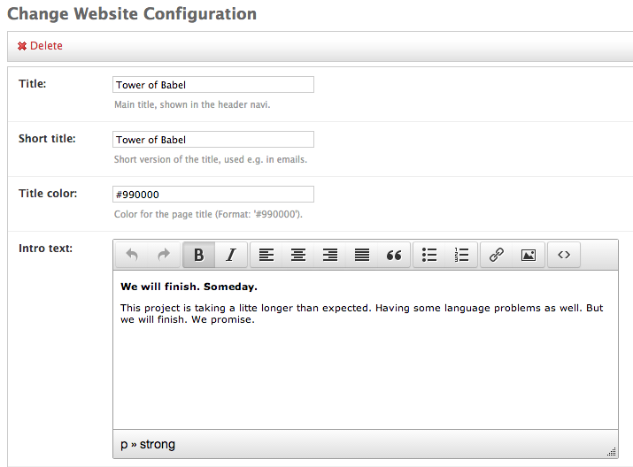

Enter/edit some text and have a look how your text is formatted on the front-end website.

Website Categories
------------------
All the main categories on front-end website - ``Home``, ``Topics``, ``Goals``,... - have their own item
in the ``Website Category`` menu in the ``admin``. Don't add or delete items here, just edit the existing ones.

You can enter an introductory text for each category and add some documents or web sources (more on that
later).

Side Quest: Adding Images
=========================
All longer description fields in the ``admin`` come with a simple WYSIWYG editor providing some basic formatting
options like text formatting or text alignment. It is also possible to adding an image to your
description.

For using an image in a description field you have to first upload it by going to the ``Images menu`` from
the ``admin overview page`` and then add a new image. Upload the image, give it a meaningful ``title`` and
provide attribution information if you took the image from an external source (this will be displayed
publicly on the website).

You can then inserting the image by going back to your item to edit, click on the image icon and choose
your image by title from the ``image list``:

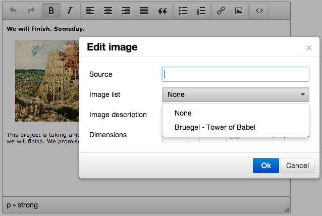

Topics (Project Parts)
======================

Now that you have your basic website configuration in place you can focus on the project itself. Start by
entering some topics around your project (for legacy reasons also sometimes
referred to as "Project Parts").

Topics will be used to structure other project items such as documents or events, so you should think about
how you want to structure your project. You can add/change topics later, but it will cause some extra work.

*Some ideas for structuring a project would be:*

* By **physical entities**, e.g. for a construction project (airport): "Terminals", "Runways", "Facilities", 
  "Public Transport"
* By some **management categories**: "Planning", "Costs", "Organization", "Controlling",...
* **Geographical entities** if things are happening in different locations: "Berlin", "Hamburg", Stuttgart"

Often this is very much depending on the project you want to describe and the specifics you are most interested in.
It is also possible to mix some of the topic dimensions from the examples above.

Adding a Topic
--------------
For adding a topic go to the ``Topic (Project Part)`` section in the ``admin`` and add a new entry.

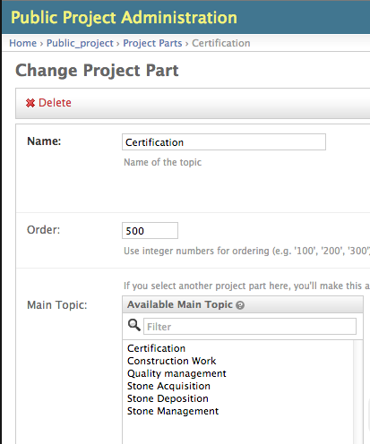

Start by providing a meaningful ``name`` and a ``description`` of your topic.

If you have a fairly complex project you want to present on your website it may be useful to **hierarchically 
structure** your project. If you choose one or more other topics you entered before as a ``Main Topic``,
your new topic will be listed as a ``Sub Topic`` under these main topics. 

Side Quest: Ordering Items
==========================

Many item types come with an ``order`` attribute you can use to determine the order the items are displayed
on the website.

Items are ordered by entering integer numbers, starting from low to high. So ``100``, ``200``, ``300``, ``400``, 
``500`` would order items in the desired manner. It is recommended to user numbers in steps by ``100`` 
(``1``, ``2``, ``3``, ``4``, ``5`` would work as well). This makes it easier to change ordering afterwards. 
For getting the fifth element as first, you just have to change ``500`` to ``50``, leading to a ``50``, ``100``, 
``200``, ``300``, ``400`` order. Otherwise you would have to go to every single element and change every 
``order`` entry to have the same effect.

Participants
============

You can enter information on the different stakeholders of your project in the ``Participants`` menu in the
``admin``. 

Participants are structured in their category on the front-end website by type. You have to first enter the
``Participant Type`` menu in the ``admin`` and think about what type of participants you will have. This
could be something generic like "Administration", "Politics", "Companies", but also something more tailored
to your project. 

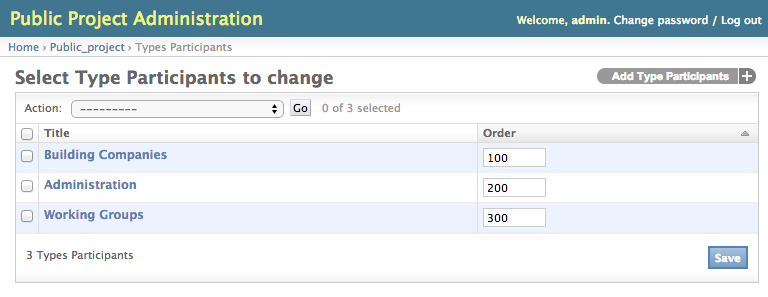

Once you have your participant types in place you can add/edit a concrete participant. Start by providing
a ``name``, choosing one of the ``participant types`` you entered before and provide a brief description.  

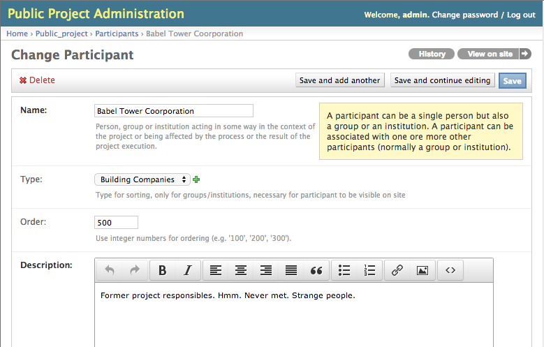

Participants can be organized very flexibly and can both be institutions (companies, organizations and so on)
or human beings. A particiant can have a ``membership`` relation to another participant. Normally this will mean
a person beeing a ``Member`` of a company or organization beeing deployed there, but this can also be 
a ministry being part of a government, depending on what you want to describe.

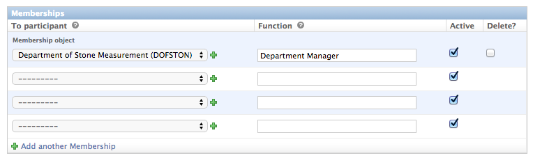

Side Quest: Adding Search Tags
==============================

For most types of project items you are able to add ``Search Tags`` to enrich the item data. These are mainly
used for automatically finding fitting document content associated with this item.

The following ``Search Tags`` for the "Department of Stone Measurement" participant in the example...

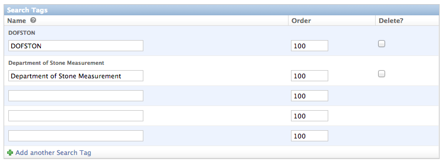

...leads to documents containing these tags being listed on the participant page:

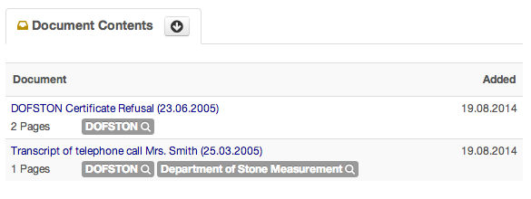

For particpants it makes sense use synonyms or abbreviations of a participants name as a ``Search Tag``,
for a topic tags describing the content of the topic might be useful. Just experiment with this a bit.
Note that you can't see the effects of a search tag before you added some documents.

Events
======

You can add important events around your project in the ``Events`` menu of the administration interface,
which are then displayed chronologically as well as sorted by the topics you provided on the front-end
website:

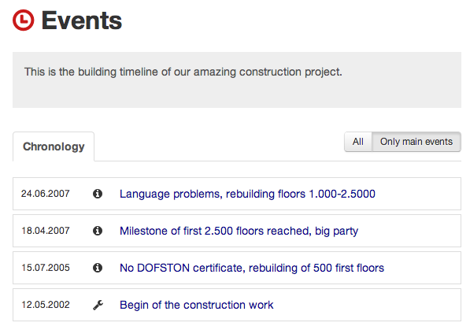

One of the central concepts of ``DPP`` is, that you can provide connections between different items/aspects
of your project whereever possible.

Events e.g. can be connected with several participants and project topics:

.. image:: images/screenshots/v06/admin_event_form_connections.png

These connections are then presented on the front-end website together with some identifying icons:

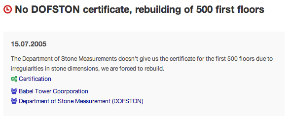

This makes it very easy for end-users of the site to jump from item to item and explore the different
aspects of the project.

Side Quest: Providing Web Sources
=================================

If you are describing a project of public interest it is very likely that important events are accompanied
by media coverage and web articles.

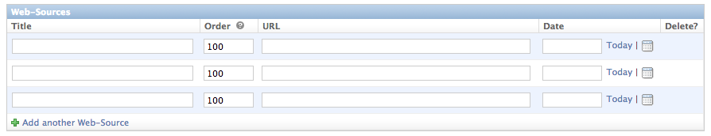

Adding ``web sources`` to project items is a very integral part of ``DPP`` you should make heavy use of and
is possible for nearly every item type. Often many things have already been written on the web - there are
Wikipedia articles on participants and news coverage of events - and it is of no necessity to write all these
things again. Instead it often makes more sense - and is also less work - to link to the original source.

Documents
=========

In ``DPP`` it is possible to provide documents about and from a project
and then interlink this document with other participants, topics or events. For adding a document go to the
``Document`` menu in the ``admin``.

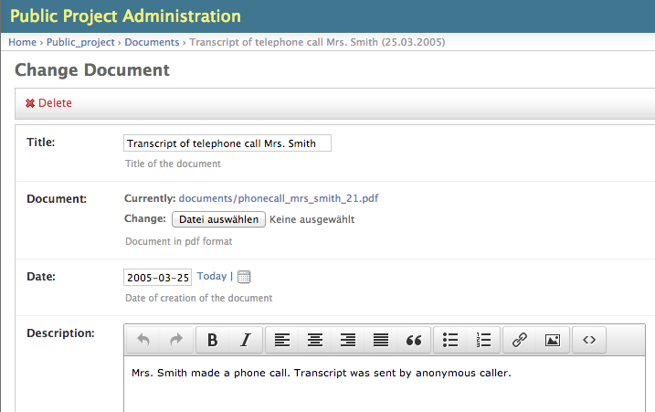

The document is then presented on the front-end website by the **integrated PDF viewer**. It also possible
to **full-text search** through the document.

Side Quest: Managing User Comments
==================================

Beside from working out the structures and interdependencies of a project yourself you can rely on interested
users visiting your site and encourage them to participate with their knowledge. For that ``DPP`` comes
with an advanced commenting system.

Users are able to comment on every item of the project and connect their comment with additional participants,
documents, etc.:

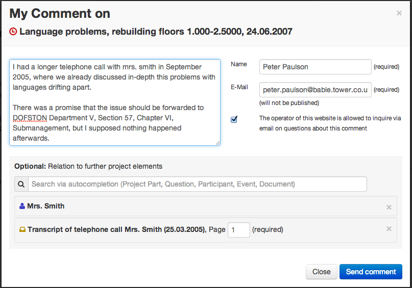

``Comments`` are displayed directly on the front-end website but have to be reviewed and published by an 
``admin user``. Every ``admin user``, where ``Receive new comment emails`` is set, gets an email when a user
is commenting something and can publish the comment via a link in the mail.

A comment can also be published directly in the ``admin`` by going to the specific ``Comment`` in the ``Comments``
menu:

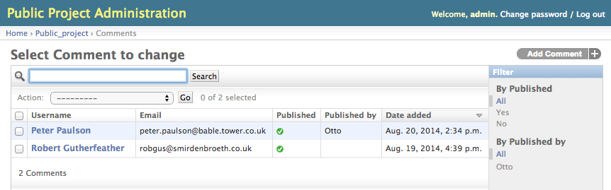

Goals
=====

``DPP`` lets you retrace and publish the development of project goals.

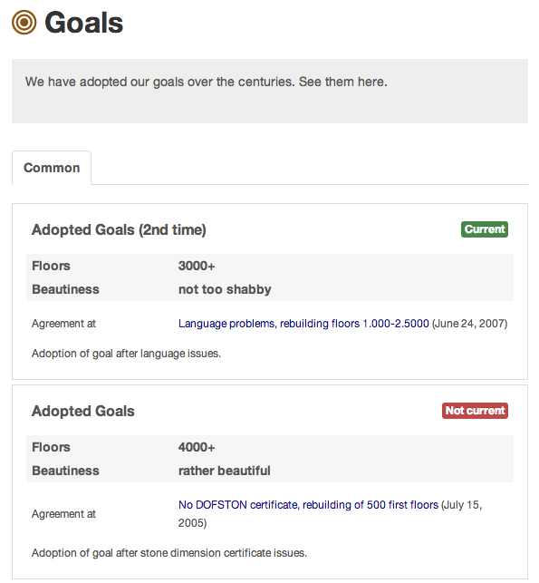

For entering/editing a goal go to the ``Goals`` menu in the ``admin``. Each ``Goal`` is a set of ``performance
figures`` which were agreed on in some point in time and may be still current or not. 

In our example ``performance figures`` are "floors" and "beautiness", but this can be anything you like
and you want to focus on depending on your project, like "costs", "capacity" and so on.

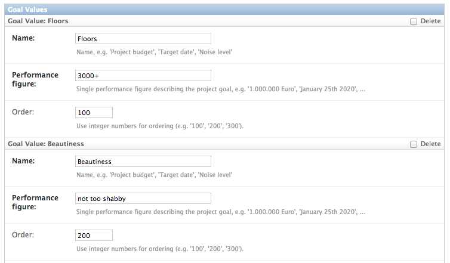

Questions
=========

If you have open questions or investigate some issues around your project, you can publish these questions
in the ``Questions`` section.

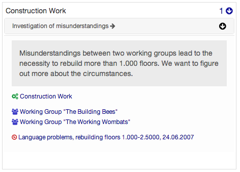

Go to the ``Questions`` menu in the ``admin`` and enter a ``title``, a ``description`` and one or several
``topics`` your question belongs to. You can also connect other items of your project with the question.

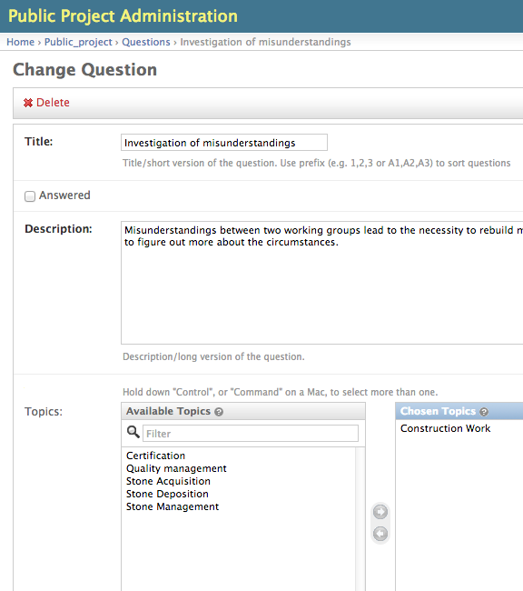

If a question is later answered you can check the ``answered`` checkbox and optionally provide a description
of the answer in the additional text box.

Side Quest: Assigning Research Requests
=======================================

If you want to go one step further including your users into the investigation of your project you can
publish research requests associated with questions on your site.

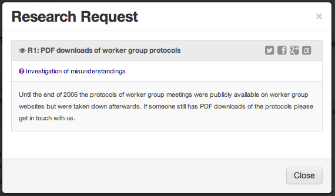

In a research request you can describe a concrete task - researching some information, providing some
special knowledge, helping in analyzing a document,... - and make it public for everyone capable to take part.

**Adding a research request is not working (comfortably) on the admin interface.** Instead log yourself in the
system (on the admin). Then go to the question you want associate a research request with on the front-end
website. There you find a button ``New (YOUR_USERNAME) ->`` on top of the ``Research Requests Box``.

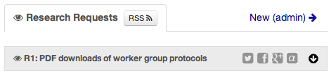

Clicking this button opens a form to enter a new research request.
