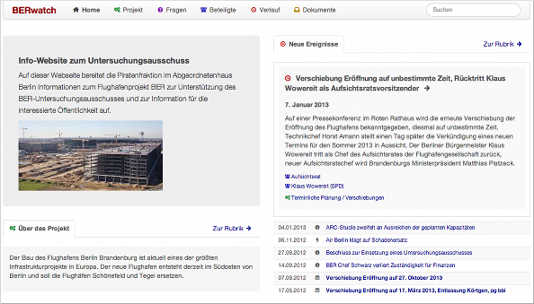
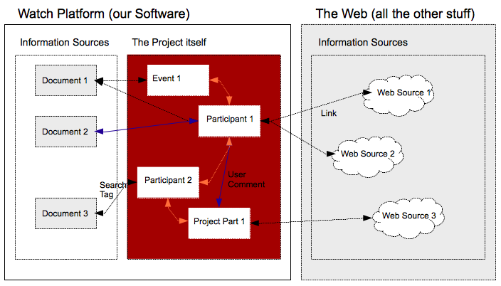
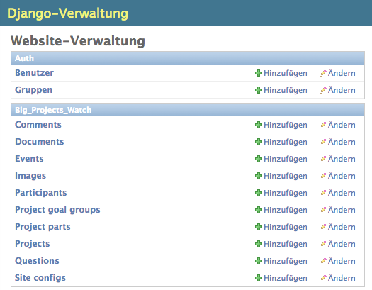
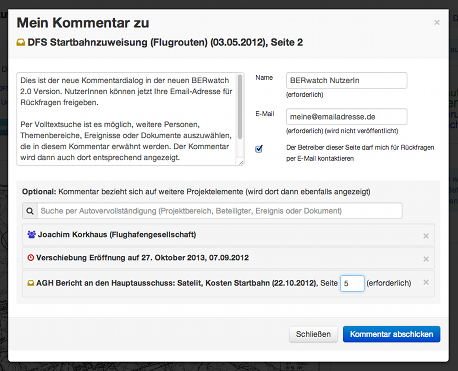
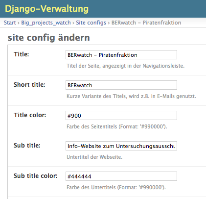
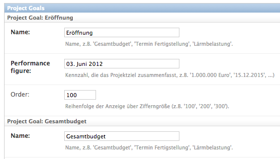
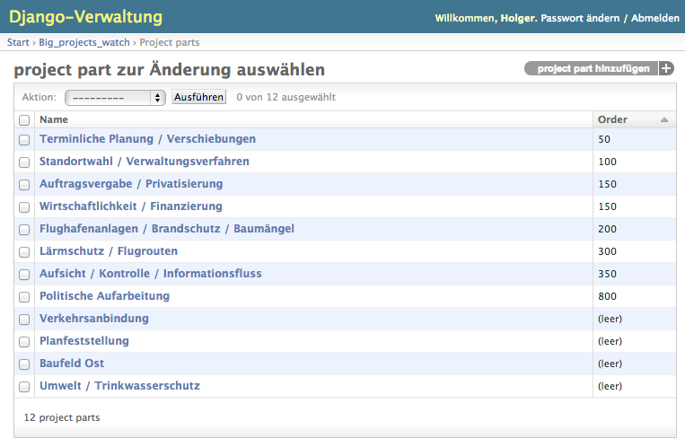
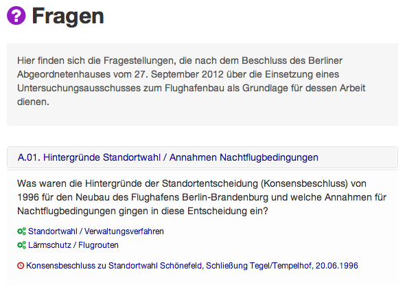
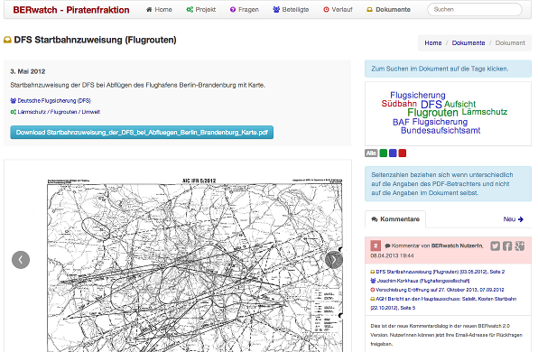

=====
Users
=====

Features
--------
DPP provides an **admin interface** for entering/updating:

* A general project description
* The goals of a project
* The project structure
* A timeline of events
* The various actors and stakehoders
* Project documents
* Questions around the project
* Web sources wherever possible

On the **frontend side**, it lays out the project data in a clearly represented way, 
interlinks between the different project elements and provides:

* A dashboard on the main page bringing together the most relevant, current information
* Universal search
* A document viewer for pdfs
* User comments interlinking different project elements
* Relevant tag clouds for document content
* Supported languages: English (beta), German

Introduction and Basic Concepts
===============================

Big projects are beasts and even for the people acting inside a project it is often hard to understand
what is going on on a broader scale. For an interested public trying to follow the progress of a publicly
funded project or to help out with local or specialized knowledge this is even harder. Lots of things are
happening in different areas of the project, many actors are involved and lots of information sources with
project results are produced and distributed over various places.

This software helps to build a central web platform around a project to make things more transparent.
On the backend side it comes with an especially targeted admin interface. General information about the project,
its basic structure and its goals can be provided and the admin user can enter information about events,
participants and questions around the project. All this information is then layouted on the frontend
website in a beautiful and suitable way.

The provided project data can be connected in various ways. Which events or questions belong to which
project topics? Which participants are involved in which events? Which are the responsible actors
in a project? All these interconnections are then used to structure the information on the frontend
website and let people easily navigate between the different project elements.

In a project a lot of the information is often already existing, it is just not as accessible as
it could (should) be. To tap into the various information sources which are available on the internet, 
web links can be provided for nearly every project element. Documents can be uploaded directly into DPP
and connected to other project elements in various ways.

There is another type of information relevant for many public projects which cannot be reached by a 
Google search and is not even hidden in project documents: often people not directly involved in a
project have knowledge about a special project topic, maybe because they work in a related field or
they have got valuable knowledge about the local circumstances. To encourage people to share this
knowledge, all project elements on the frontend website can be commented by the visiting users.

Where to reach your site
========================

Before you can start you need a working DPP instance, see the :ref:`developers` section for more about
this. Since this is not as easy as a Wordpress installation, you will probably need to be or have an
IT guy for this task. Like with a normal content management system the site then separates into a 
publicly reachable site, something like::

	http://www.yourprojectwatchsite.org
	
and a corresponding admin site, something like::

	http://www.yourprojectwatchsite.org/admin/
	
which should be secured by a username/password combination.

How to process
==============

A focus of this software is to make it possible to define connections between different project
elements. Due to the dependencies of the element types, it makes sense to keep a certain order when
first entering project data. Otherwise one would jump back and forth all the time because some data is
missing to be able to enter some other data. 

When you have got access to the admin interface you first have to provide some basic site and project
information. You can then define a structure for your project and use this structure when entering
relevant project events and associated participants. Finally you can enter questions, upload 
documents and provide search tags for project parts, events and participants (leave them out when first
entering these data types).

1. Provide basic site configuration and project description
2. Structure the project into topics
3. Enter events and participants
4. Enter questions around the project
5. Upload your documents and providing search tags

Basic Site Configuration and Project Description
================================================

Site Configuration
------------------

To configure some basic settings of your project website, you have to create a ``SiteConfig`` entry in
your admin interface. The most important thing here is the definition of a title and a short variant of it
beeing displayed on various parts of the site (generally, also the long title version should be relatively
short). In the ``SiteConfig`` form you also provide some basic texts for your website like an intro text
or a text for the contact page and you can change some layout settings like the color for your site titles.
Some of the texts you enter can be formatted using HTML tags.

General Project Description
---------------------------

You provide some basic data about the project by adding a ``Project`` entry in the admin. The various
descriptions you provide there are shown as introductory texts through out the website for the different
categories. 

Project Goals
-------------

Projects are normally done to reach something (if not, you should probably do another kind of website :-)).
In DPP you can define a set of project goals as a ``ProjectGoalGroup``. A ``ProjectGoalGroup`` consists
of several single project goals, each having a performance figure, which can be freely defined. This can
be e.g. the overall project costs, the date the project should be finished but also a short textual 
description of a goal ("provide village x with clean water"). You can define several ``ProjectGoalGroups``
if project goals change over time.

After having provided data for these three entries you should see a basic layout of your website
when opening the main frontend site url in your browser.

Entering the Project Elements
=============================

The definition of the different project elements is the heart of the system and you should take
your time for it, think more in "days" than in "hours". If your system shall be useful you have to
provide a certain density of information, and normally you have to do some investigate work for it.
When you first enter your project elements, don't add search tags yet.

Define your Project Structure
-----------------------------

Your project is structured by defining ``ProjectParts`` in the admin interface. Try to find 6-12 
subject topics which are relevant for the project and cover the different project parts and 
provide a meaningful description for these topics.

Enter Events and Participants
-----------------------------

It is a bit difficult to think about all the relevant actors of a project, if you want to add them
one after the other. So one strategy is here to start to reconstruct the relevant events around a 
project and add the participants alongside. 

.. image:: images/screenshot_admin_event.png

Questions around the Project
----------------------------

If you are running a monitoring website about a big publicly funded project, you have got probably
questions like: What are the reasons that the project is running so late? Who was responsible for
certain actions? If you are running a website from within an institution to inform the public about
your project, you might have questions like: What do you think are the advantages for location A for
our construction project? Where can we get information about xy? You can enter these questions in the
admin and associate project parts, participants and events with them, they will then appear in the 
correspondig category on the website. 

Uplad your Documents and providing Search Tags
----------------------------------------------

``Django Public Project`` comes with an integrated PDF viewer directly on the website, where users
can comment single document pages. You can upload documents about or generated in the project
in the ``Document`` section of the admin and associate the documents with other project elements.

DPP comes with a mechanism to associate corresponding document content to different project elements
called ``SearchTags``. After you uploaded your documents you can enter these search tags for your 
project parts, events and participants. ``SearchTags`` are keywords, which do a document search.
All documents found by a certain keyword for a project element are then associated with this element.
For a project part like "Financing", you could define search tags like "Credit", "Budget" or "Investment".
For a participant often the name/last name of a person/institution is sufficient, e.g. "Obama" for 
Barack Obama (whichever project that is :-)). For an event, it's a bit hard to find good search tags,
don't use to general terms there. Play around with the site search a bit to get a feeling for choosing
relevant search tags. 

User Comments
=============

On DPP websites users can comment on nearly everything and connect their comments to various elements
of the project. Comments are then shown alongside every connected element. All admin users having
activated the "Receive new comment emails" in the admin user settings receive an email after someone 
sent a comment and can then activate the comment to be shown on the website.

Where to go from here?
======================

These basic informations should help you to get started setting up a project watch website. Keep in mind
that this is just the one half of the story.

Keep track of new events
------------------------

For keeping your site useful you should keep pace with new events and actors and update your site regularly.
Spend a similar amount of time on updating and enhancing the connections between elements like you spend 
on updating and adding new data.

Social Media
------------

DPP sites live by the interaction with the users. It makes a lot of sense to run corresponding social 
media presences on Twitter, Facebook, Google+, App.net and the like and inform your users about new
events, participants, ... in the system, ask them questions, encourage them to comment on certain 
documents and so on. There will be more features to support these kind of things in future releases
of this software.

